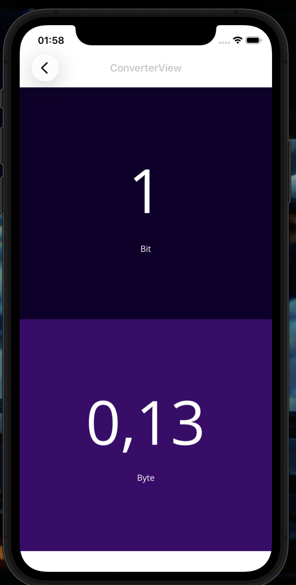
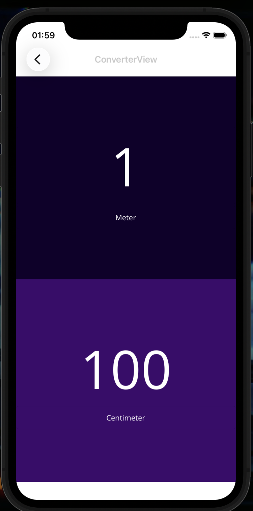
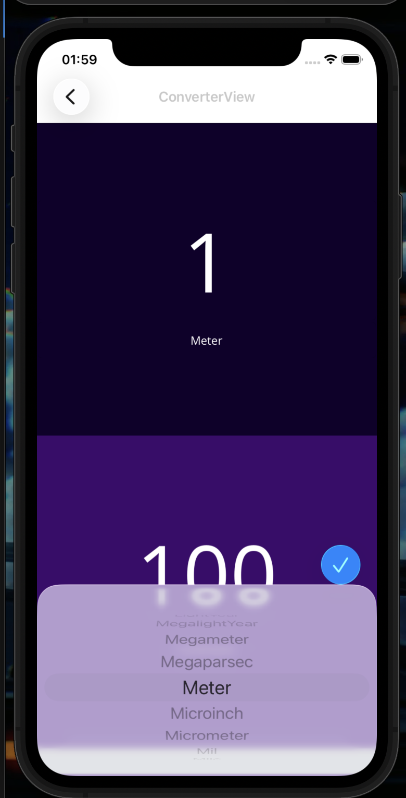

# ConvertMe

Um app de conversão de unidades feito em .NET MAUI, com foco em UI simples e conversões rápidas usando a biblioteca UnitsNet.

**Destaques**
1. Conversões em tempo real com MVVM.
2. Categorias como Information, Volume, Length, Mass, Temperature, Energy, Area, Speed e Duration.
3. Interface mobile limpa e responsiva.

**Screenshots**

  
  
  
  
  

**Stack**
1. .NET MAUI
2. CommunityToolkit.Mvvm
3. UnitsNet

**Estrutura**
1. `MVVM/Views` para as telas.
2. `MVVM/ViewModels` para a lógica de apresentação.
3. `Resources` para fontes, ícones e estilos.

**Como rodar**
1. `dotnet restore`
2. `dotnet build`
3. `dotnet maui run -f net10.0-ios`
4. `dotnet maui run -f net10.0-android`

**Observações**
1. As imagens do README ficam em `Assets/Screenshots`.
